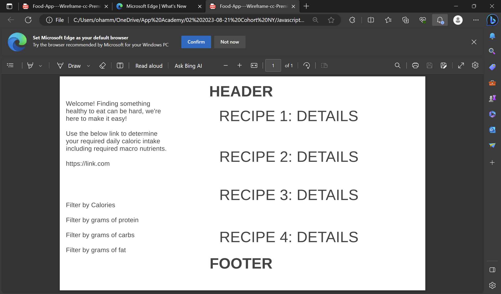

Final Proposal:

Background
You're on your way home after work/school and you're hungry, but what do you eat?  Most meals take less than 30 minutes to prepare which is less than the wait time for most delivery options.  But even then, it is easy to eat unhealthy.  Based on a persons activity, there is a formula to determine the required caloric intake in a day.  You can easily log into our app, find your recommended caloric intake, and choose a healthy meal option which will display the ingredients you can pick up on your way home!  Funny thing, I was on my way home today and I even overheard a couple asking one another what they should make for dinner!  If my app was up and running, I'd say, EatEZ and visit EatEZ.com!

Functionality & MVPs

In EatEZ, users will be able to:

{ 4-6 core features or functionalities of your project }
- A way to determine your daily caloric intake
- Possibly a calculator to convert that into required macro nutrients
- Filters for macro nutrients
- Filters for your favorite type of cuisine
In addition, this project will include:

{ 2-4 other aspects of your project, including instructions & README }
- If I have time, I would like to add a BMI calculator (either link or on the page itself)
- I would like to incorporate infinte scroll

Wireframes
 

Technologies, Libraries, APIs
I will be using the Edamam API.  This is an API whos free version allows you to look up 100 recipes at a time and returns things like ingredients, types of cuisine, calories, etc.  The drawback is that the free version doesn't have unlimited access to their database.  On the plus side, it is enough to create a working prototype of this app that I think will help a lot of people make healthy eating options.  I also might using d3 to render a graph of the macro nutrients in each recipe if I am able to get access to that data.

Implementation Timeline
Here you will detail what you hope to get done each day for this project. It serves as a roadmap for the upcoming week. You'll have the following days to work on this project:

Friday Afternoon & Weekend
Start by researching the API and be able to Parse the data
Monday
Create the HTML skeleton for the page
Tuesday
Write the javascript to make the page interactive
Wednesday
Work on styling
Thursday Morning
Tweaking as necessary
It can be quite hard to estimate how long parts of your project might take. Don't worry if you end up straying from this timeline; the goal is to have a plan in place for what you'll do & in what order, and to have a tentative pace.

You should also be aware that presentations will be Thursday afternoon, and deploying your project to GitHub Pages will take some time Thursday morning, so don't plan much for that morning.

Checklist
Live Project
☐ Includes links to your portfolio website, Github, and LinkedIn.

☐ Landing page/modal with obvious, clear instructions.

☐ Interactivity of some kind.

☐ Well styled, clean frontend.

☐ If it has music, the option to mute or stop it.

Production README
☐ Link to live version.

☐ Instructions on how to play/interact with the project.

☐ List of technologies / libraries / APIs used.

☐ Technical implementation details with (good-looking) code snippets.

☐ To-dos / future features.

☐ No .DS_Store files / debuggers / console.logs.

☐ Organized file structure, with /src and /dist directories.